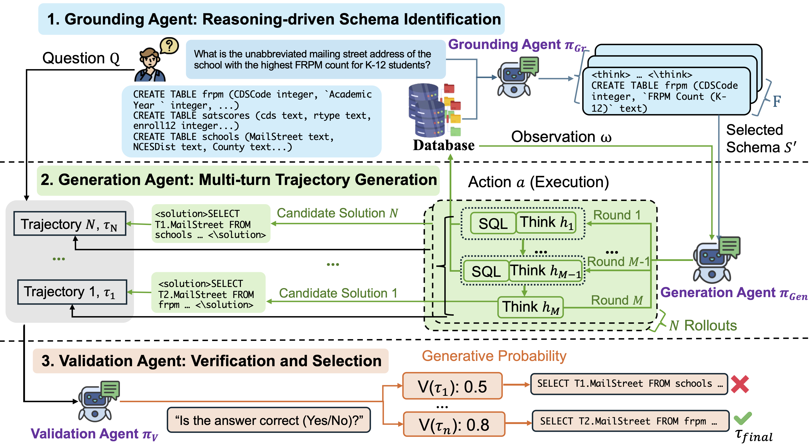

# MARS-SQL: A MULTI-AGENT REINFORCEMENT LEARNING FRAMEWORK FOR TEXT-TO-SQL

[](https://arxiv.org/abs/2511.01008)
[](https://opensource.org/licenses/MIT)
[](https://www.python.org/)

This repository contains the official implementation of MARS-SQL.

## 🧭 Overview


## 📚 Citation
```bibtex
@article{yang2025mars,
  title={MARS-SQL: A multi-agent reinforcement learning framework for Text-to-SQL},
  author={Yang, Haolin and Zhang, Jipeng and He, Zhitao and Fung, Yi R},
  journal={arXiv preprint arXiv:2511.01008},
  year={2025}
}
```

---

## 🚀 Implementation

### 1. Training

#### Environment Setup
Please refer to [Mars-train/Install.md](./Mars-train/Install.md) for detailed environment installation instructions using `uv` and `ray`.

#### Dataset Preparation
1. Download the **BIRD dataset** (dev/train databases) from the [official BIRD benchmark page](https://bird-bench.github.io/).
2. Unzip the dataset and note the absolute path to the database directory.

#### ⚙️ Configuration (Crucial Step)
Before running the training script, you **must** update the BIRD database paths in the following three files to match your local setup:

1.  `mars-train.sh`
2.  `Mars-train/verl/workers/agentic/llm_sql_agent/sqlact.py`
3.  `Mars-train/verl/workers/reward_manager/sql.py`

> [!WARNING]
> Failure to update the database paths in **all three** locations will result in execution errors.

#### Run Training
Once configured, execute the training script:

```bash
bash mars-train.sh
```

### 2. Inference

We recommend running inference in a separate environment to avoid dependency conflicts.

**Environment Setup**

```bash
# (Optional, but recommended) Create and activate a new virtual environment
conda create -n mars-infer python=3.9 -y
conda activate mars-infer

# Install all required packages
cd MARS-SQL/Mars-inference
pip install -r requirements.txt
```

**💾 Using Pre-trained Models**

Our trained MARS-SQL models (based on Qwen-7B) are publicly available on Hugging Face. You can download and use these weights directly for inference by updating the model path in the inference script:

| Model Name | Description | Hugging Face Link |
| :--- | :--- | :--- |
| **Qwen-SQL-7B-bird\_5turns\_80step** | Trained with 5 turns | [Yanghl0526/Qwen-SQL-7B-bird\_5turns\_80step](https://huggingface.co/Yanghl0526/Qwen-SQL-7B-bird_5turns_80step) |
| **Qwen-SQL-7B-bird\_10turn** | Trained with 10 turns | [Yanghl0526/Qwen-SQL-7B-bird\_10turn](https://huggingface.co/Yanghl0526/Qwen-SQL-7B-bird_10turn) |

**Run Inference**

The following command will generate 16 trajectories for each question in the dataset:

```bash
bash inference.sh
```

The output will be saved as `step80_bird_@16_turn5_test_result.parquet`

### 📊 Evaluation

After generating the inference results (parquet file), use the evaluation script to calculate metrics.

```bash
python evaluate_sql.py --input_file step80_bird_@16_turn5_test_result.parquet --db_path Bird_DB_PATH
```