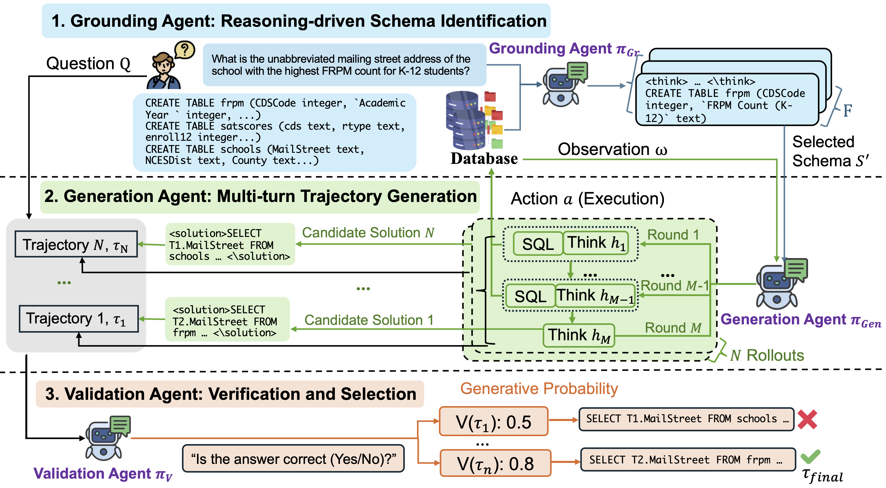

# MARS-SQL: A Multi-Agent Reinforcement Learning Framework for Text-to-SQL

[](https://arxiv.org/abs/2511.01008)
[](https://icml.cc/virtual/2026/poster/65053)
[](https://opensource.org/licenses/MIT)
[](https://www.python.org/)

This repository contains the official implementation of MARS-SQL, accepted at the
**43rd International Conference on Machine Learning (ICML 2026)**.

## 🧭 Overview



## 📁 Repository layout

| Path | Contents |
| :--- | :--- |
| [`Mars-train/`](./Mars-train/) | Reinforcement-learning environment, configuration, and training entry point |
| [`Mars-inference/`](./Mars-inference/) | Generation, candidate selection, and execution-based evaluation tools |
| [`data/`](./data/) | Prepared Parquet inputs for BIRD, Spider, and validation runs |
| [`figs/`](./figs/) | Architecture and workflow figures used by the documentation |

## 📚 Citation

Please cite the ICML 2026 paper using the entry below (also available as
[`CITATION.bib`](./CITATION.bib)):

```bibtex
@inproceedings{yang2026marssql,
  title={A Multi-Agent Reinforcement Learning Framework For Text-To-SQL},
  author={Yang, Haolin and Zhang, Youran and others},
  booktitle={Proceedings of the 43rd International Conference on Machine Learning (ICML)},
  year={2026},
  url={https://icml.cc/virtual/2026/poster/65053}
}
```

---

## 🚀 Implementation

### 1. Training

#### Environment Setup
Please refer to the [training guide](./Mars-train/README.md) and
[installation notes](./Mars-train/Install.md) for environment setup using `uv`
and Ray.

#### Dataset Preparation
1. Download the **BIRD dataset** (dev/train databases) from the [official BIRD benchmark page](https://bird-bench.github.io/).
2. Unzip the dataset and note the absolute path to the database directory.

#### ⚙️ Configuration

The entry point reads local paths and credentials from environment variables;
source files do not need to be edited. At minimum, set `DB_PATH`, `CKPT_PATH`,
and `WANDB_API_KEY`.

#### Run Training
Once configured, execute the training script:

```bash
export DB_PATH=/absolute/path/to/bird/databases
export CKPT_PATH=/absolute/path/to/checkpoints
export WANDB_API_KEY=your_wandb_api_key
bash Mars-train/mars-train.sh
```

### 2. Inference

We recommend running inference in a separate environment to avoid dependency conflicts.

**Environment Setup**

```bash
# (Optional, but recommended) Create and activate a new virtual environment
conda create -n mars-infer python=3.10 -y
conda activate mars-infer

# Install all required packages
cd MARS-SQL/Mars-inference
pip install -r requirements.txt
```

**💾 Using Pre-trained Models**

Our trained MARS-SQL models (based on Qwen-7B) are publicly available on Hugging Face:

| Model Name | Description | Hugging Face Link |
| :--- | :--- | :--- |
| **Qwen-SQL-7B-bird\_5turns\_80step** | Trained with 5 turns | [Yanghl0526/Qwen-SQL-7B-bird\_5turns\_80step](https://huggingface.co/Yanghl0526/Qwen-SQL-7B-bird_5turns_80step) |
| **Qwen-SQL-7B-bird\_10turn** | Trained with 10 turns | [Yanghl0526/Qwen-SQL-7B-bird\_10turn](https://huggingface.co/Yanghl0526/Qwen-SQL-7B-bird_10turn) |

**Run Inference**

The following command will generate 16 trajectories for each question in the dataset:

```bash
export DB_PATH=/absolute/path/to/bird/databases
bash inference.sh
```

The output will be saved as `step80_bird_@16_turn5_test_result.parquet`

### 📊 Evaluation

After generating the inference results (parquet file), use the evaluation script to calculate metrics.

```bash
python evaluate_sql.py --input_file step80_bird_@16_turn5_test_result.parquet --db_path Bird_DB_PATH
```

See the [inference guide](./Mars-inference/README.md) for all configurable paths,
model overrides, and candidate-selection utilities.
